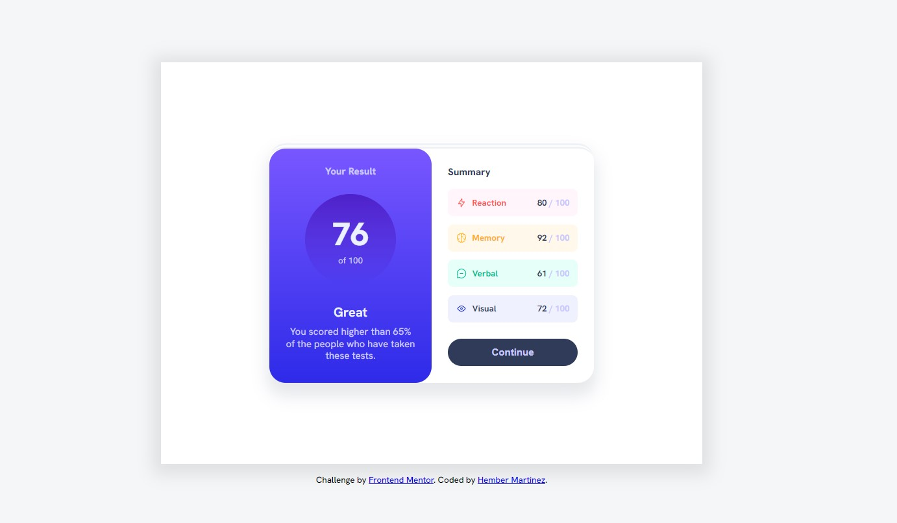

# Frontend Mentor - Solución de componente de resumen de resultados

Esta es una solución al [desafío del componente de resumen de resultados en Frontend Mentor] (https://www.frontendmentor.io/challenges/results-summary-component-CE_K6s0maV). Los desafíos de Frontend Mentor lo ayudan a mejorar sus habilidades de codificación mediante la creación de proyectos realistas.

## table of Contents

- [table of Contents](#table-of-Contents)
   - [Screenshot](#Screenshot)
   - [Links](#Links)
- [My process](#My-process)
   - [Built with](#Built-with)
   - [What I learned](#What-I-learned)
   - [Continued development](#Continued-development)
   - [Useful resources](#Useful-resources)
- [Author](#Author)

### Screenshot



### Links

- Solution URL: [Add solution URL here](https://github.com/hmartinezdc/Results-summary-component.git)
- Live Site URL: [Add live site URL here](https://result-summary-components-fm.netlify.app/)

## My process

### Built with

- Semantic HTML5 markup
- CSS custom properties
- Flexbox
- JavaScript DOM
- Mobile-first workflow
- fetch JSON

### What I learned

In this section I learned how to use the request to the JSON file with JavaScript functionalities.
```js
function PrintData(data) {
    let html = '';
    for(let i = 0; i < data.length; i++) {
        html += `
        <div class="summary__category summary__category-${data[i].category}">
          <div class="category category-${data[i].category}">
            
            <P>${data[i].category}</P>
          </div>
          <div class="score">
            <p>${data[i].score} <span class="score-color">/ 100</span></p>
          </div>
        </div>
        `;
    }
    dataList.innerHTML = html;
}
```

### Continued development

Use this section to outline areas that you want to continue focusing on in future projects. These could be concepts you're still not completely comfortable with or techniques you found useful that you want to refine and perfect.

**Note: Delete this note and the content within this section and replace with your own plans for continued development.**

### Useful resources
- [fonts](https://fonts.google.com) - This page helped me to establish the sources of the project, it is very useful because you no longer have to install external sources.


## Author

- [HEMBER MARTINEZ]
- Frontend Mentor - [@yourusername](https://www.frontendmentor.io/profile/yourusername)

