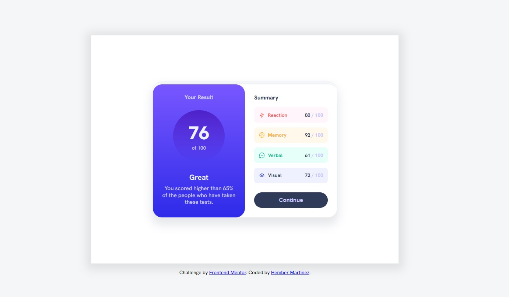

# Frontend Mentor - Results summary component

## Welcome! 👋

Thanks for checking out this front-end coding challenge.

[Frontend Mentor](https://www.frontendmentor.io) challenges help you improve your coding skills by building realistic projects.

**Para hacer este desafío, necesitas una comprensión básica de HTML y CSS.**

## El reto

Su desafío es construir este componente de resumen de resultados y lograr que se parezca lo más posible al diseño.

Puedes usar cualquier herramienta que te guste para ayudarte a completar el desafío. Entonces, si tienes algo que te gustaría practicar, no dudes en intentarlo.

Proporcionamos los datos de los resultados en un archivo `data.json` local. Entonces puede usar eso para agregar los resultados y el puntaje total dinámicamente si lo desea.

Sus usuarios deberían poder:

- Ver el diseño óptimo para la interfaz según el tamaño de pantalla de su dispositivo
- Vea los estados de desplazamiento y enfoque para todos los elementos interactivos en la página

쯈uieres algo de apoyo en el desafío? [칔nase a nuestra comunidad de Slack](https://www.frontendmentor.io/slack) y haga preguntas en el canal **#help**.

## Dónde encontrar todo

Tu tarea es construir el proyecto con los diseños dentro de la carpeta `/diseño`. Encontrará una versión móvil y otra de escritorio del diseño.

Los diseños están en formato JPG estático. El uso de archivos JPG significará que deberá usar su mejor criterio para estilos como "tamaño de fuente", "relleno" y "margen".

Si desea los archivos de diseño (proporcionamos versiones de Sketch y Figma) para inspeccionar el diseño con más detalle, puede [suscribirse como miembro PRO] (https://www.frontendmentor.io/pro).

Todos los activos necesarios para este proyecto están en la carpeta `/assets`. Las imágenes ya están exportadas para el tamaño de pantalla correcto y optimizadas.

También incluimos archivos de fuentes estáticas y variables para las fuentes requeridas para este proyecto. Puede elegir vincular a Google Fonts o usar los archivos de fuentes locales para alojar las fuentes usted mismo. Tenga en cuenta que hemos eliminado los archivos de fuentes estáticas para los pesos de fuente que no son necesarios para este proyecto.

También hay un archivo `style-guide.md` que contiene la información que necesitará, como la paleta de colores y las fuentes.

## Construyendo tu proyecto

Siéntase libre de usar cualquier flujo de trabajo con el que se sienta cómodo. A continuación se sugiere un proceso, pero no sienta que necesita seguir estos pasos:

1. Inicializa tu proyecto como repositorio público en [GitHub](https://github.com/). La creación de un repositorio hará que sea más fácil compartir su código con la comunidad si necesita ayuda. Si no está seguro de cómo hacer esto, [lea este recurso Try Git] (https://try.github.io/).
2. Configure su repositorio para publicar su código en una dirección web. Esto también será útil si necesita ayuda durante un desafío, ya que puede compartir la URL de su proyecto con la URL de su repositorio. Hay varias maneras de hacer esto, y proporcionamos algunas recomendaciones a continuación.
3. Mire los diseños para comenzar a planificar cómo abordará el proyecto. Este paso es crucial para ayudarlo a pensar con anticipación en las clases de CSS para crear estilos reutilizables.
4. Antes de agregar estilos, estructura tu contenido con HTML. Escribir tu HTML primero puede ayudar a centrar tu atención en crear contenido bien estructurado.
5. Escriba los estilos base para su proyecto, incluidos los estilos de contenido general, como `font-family` y `font-size`.
6. Comience a agregar estilos en la parte superior de la página y siga hacia abajo. Pase a la siguiente sección solo cuando esté satisfecho de haber completado el área en la que está trabajando.

## Desplegando tu proyecto

Como se mencionó anteriormente, hay muchas formas de alojar su proyecto de forma gratuita. Nuestros anfitriones recomendados son:

- [Páginas de GitHub](https://pages.github.com/)
- [Vercel](https://vercel.com/)
- [Netlify](https://www.netlify.com/)

Puede alojar su sitio utilizando una de estas soluciones o cualquiera de nuestros otros proveedores de confianza. [Lea más sobre nuestros hosts recomendados y de confianza](https://medium.com/frontend-mentor/frontend-mentor-trusted-hosting-providers-bf000dfebe).

## Crea un `README.md` personalizado

We strongly recommend overwriting this `README.md` with a custom one. We've provided a template inside the [`README-template.md`](./README-template.md) file in this starter code.

The template provides a guide for what to add. A custom `README` will help you explain your project and reflect on your learnings. Please feel free to edit our template as much as you like.

Once you've added your information to the template, delete this file and rename the `README-template.md` file to `README.md`. That will make it show up as your repository's README file.

## Submitting your solution

Submit your solution on the platform for the rest of the community to see. Follow our ["Complete guide to submitting solutions"](https://medium.com/frontend-mentor/a-complete-guide-to-submitting-solutions-on-frontend-mentor-ac6384162248) for tips on how to do this.

Remember, if you're looking for feedback on your solution, be sure to ask questions when submitting it. The more specific and detailed you are with your questions, the higher the chance you'll get valuable feedback from the community.

## Sharing your solution

There are multiple places you can share your solution:

1. Share your solution page in the **#finished-projects** channel of the [Slack community](https://www.frontendmentor.io/slack). 
2. Tweet [@frontendmentor](https://twitter.com/frontendmentor) and mention **@frontendmentor**, including the repo and live URLs in the tweet. We'd love to take a look at what you've built and help share it around.
3. Share your solution on other social channels like LinkedIn.
4. Blog about your experience building your project. Writing about your workflow, technical choices, and talking through your code is a brilliant way to reinforce what you've learned. Great platforms to write on are [dev.to](https://dev.to/), [Hashnode](https://hashnode.com/), and [CodeNewbie](https://community.codenewbie.org/).

We provide templates to help you share your solution once you've submitted it on the platform. Please do edit them and include specific questions when you're looking for feedback. 

The more specific you are with your questions the more likely it is that another member of the community will give you feedback.

## Got feedback for us?

We love receiving feedback! We're always looking to improve our challenges and our platform. So if you have anything you'd like to mention, please email hi[at]frontendmentor[dot]io.

This challenge is completely free. Please share it with anyone who will find it useful for practice.

**Have fun building!** 🚀
